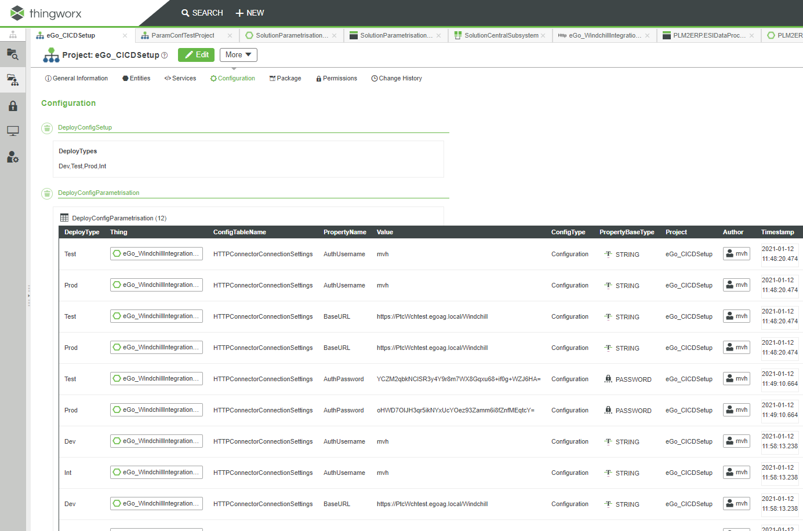

# TWX Solution Parametrisation


## Project/Package parametrisation

* Need
  * When you build solutions with multiple TWXservers\(typically a Dev/Test/Prod setup\) you can use SolutionCentral to automate the packaging and deployment in a repeatable way
  * Often the Dev\, Test and Prod environments differ in configuration aspects and those differences would have to be manually adjusted after the SolutionCentral deployment\, which can be repetitive and tedious
* Process
  * Extract configurations
  * Filter them to the relevant subset that differs between deployments
  * Adjust values to cover the differences
  * Package and Deploy solutions \(SCootb\)
  * Apply configurations post\-deploy

## User interface


## Extract configurations

* Configurations are saved on Projects and will be deployed with SolutionCentral
  * Extract configurations from Things in TWX \(What about Subsystems\, Media\, …?\)
  * Extract Properties of Category _DeployConfig_
  * Save those in a Configuration table on the selected project
    * For each config entry you will get a Dev\, Test and Prod copy\(List is configurable\)
  * Passwords will be encrypted when an encryption key is specified
    * Encryption keys are TWX generated\.With the  button you can generate a new one\.
    * You must use the same encryption key to decrypt when applying the config\. Note it down\!


## Filter to relevant configurations

You reduce the set of applicable configurations by multi\-selecting and deleting entries


## Edit configuration parameters

* Using the table inline editing capabilities you can change the values for your environment\(Dev\, Test\,Prod or others\)
  * Put table in Edit mode with _Edit_ Button
  * Click and edit the value\.Don‘t forget to hit enter after editing\.
  * With the _Save_ button the changes will be persisted
  * Passwords will be encrypted when an Encryption key is specified


## Apply configurations

* After the packaging and deployment with SolutionCentral you can set the Configurations according to the system type
  * This step must be done on the target system\. It can be automated with a REST call\.
  * You have to select the Projects of which you want to set configurations\.
  * The table can be filtered by the system type as well\. This way you see exactly the configs that will get deployed
  * When an encryption key is specified passwords will be decrypted before loading


## Apply configuration by script

* Example scripts to apply configuration\(s\):
  * Apply config of target system deploy type for projects _ProjectX_ and _ProjectY_ with EncryptionKey _JCNP5uKl254PElZrSDeq93JzxMJf\+0HxFiYj2bMO1GY=_
  * Apply config of DeployType _Dev_ for all Projects that are on the system without encryption

````
curl --location --request POST 'https://abc.def.com/Thingworx/Things/SolutionParametrisationHelper/Services/ApplyConfiguration' 
	--header 'Accept: application/json' --header 'Content-Type: application/json' --header 'appKey: fb087f18-fd02-4095-93e8-48218ff2e99c' 
	--data-raw '{
		"encryptionKey": "JCNP5uKl254PElZrSDeq93JzxMJf+0HxFiYj2bMO1GY=",
		"projects": {
			"rows": [ {"name": "ProjectX"}, {"name": "ProjectY"}],
			"dataShape": {"fieldDefinitions": {"name": {"name": "name", "baseType": "STRING"}}}
		}
	}'

curl --location --request POST 'https://abc.def.com/Thingworx/Things/SolutionParametrisationHelper/Services/ApplyConfiguration' 
	--header 'Accept: application/json' --header 'Content-Type: application/json' --header 'appKey: fb087f18-fd02-4095-93e8-48218ff2e99c' 
	--data-raw '{
		"DeployType": "Dev",
		"ApplyToAllProjects": true
	}'
````

## Steps to encrypt passwords with a new key

1. Open unencrypted project without Encryption Key specified
2. Enter Edit Mode
3. Edit value that should be encrypted \(only changed values will be saved and encrypted\!\)
4. Specify Encryption key __but don‘t hit Enter__
5. Save Table

## How it is done



The __SolutionParametrisationHelper__ Thing has a couple of javascript\-based services that are used in the __SolutionParametrisationMashup__ that provides the Admin UI\. 
The services can also be invoked through REST calls for deployment automation

Portable Configurations are stored on the Projects in a Configuration Table

Configuration of the target system deploy type and list of available deploy types is stored in a configuration of __SolutionParametrisationHelper__ Thing


## Limitations and next steps

* Support for multi\-row configurations\, e\.g\. _AuthorizationServerScopesSettings_
* Support for Subsystems \(e\.g\.FederationSubsystem\) and Media Entities \(Media Proxy\)
* SolutionCentralcapability that allows to mark a target system with the system type
  * This could be added as a Platform setting and then resolved TWX\-side alternatively

